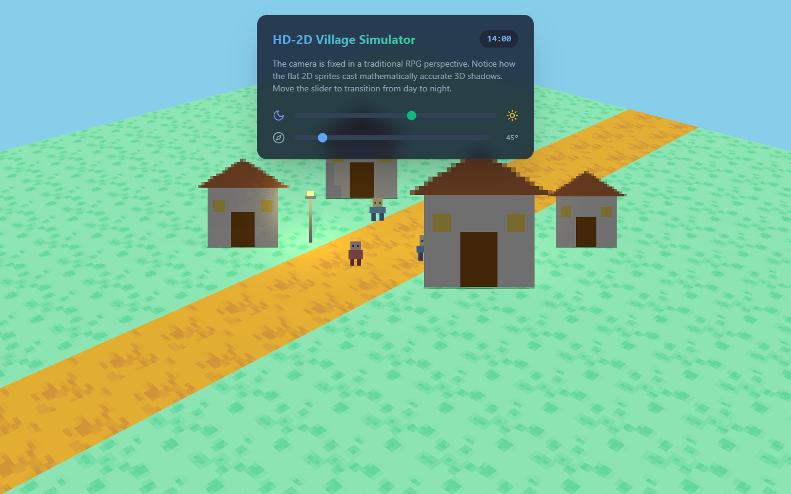

# HD-2D Village Simulator — shadow reference

A minimal **reference** demo (vanilla three.js + React) that shows flat 2D billboard sprites both
**casting and receiving** mathematically-accurate 3D shadows — including shadows that fall *across other
sprites*. All art is generated procedurally on a `<canvas>` (no external image files), so it's the
clearest possible isolation of the shadow mechanics.



It's kept here as the canonical example of the key detail: **every sprite sets `receiveShadow = true`**
(not just the ground). That's what makes one sprite's shadow appear *on* another. The fuller, real-asset
HD-2D scene lives in [`../hd2d-village/`](../hd2d-village/).

## Run it

Needs a static HTTP server (ES-module import maps don't resolve over `file://`):

```bash
npx serve docs        # → http://localhost:3000/hd2d-village-sim/
```

It pulls React, three.js and lucide-react from a CDN and transpiles JSX in-browser with Babel — no build
step. Tailwind (Play CDN) handles the overlay styling.

## Controls
- **Time-of-day** slider (00:00–24:00) — day → night, lamps fade in.
- **Sun direction** slider (0–360°) — rotates the shadow trajectory.

## Notes
The only change from the original source was adapting the imports/mount to run standalone from a CDN, plus
a `ResizeObserver` so the WebGL canvas picks up its size once Tailwind's async CDN styles apply (otherwise
it mounts at 0×0 and renders nothing).
