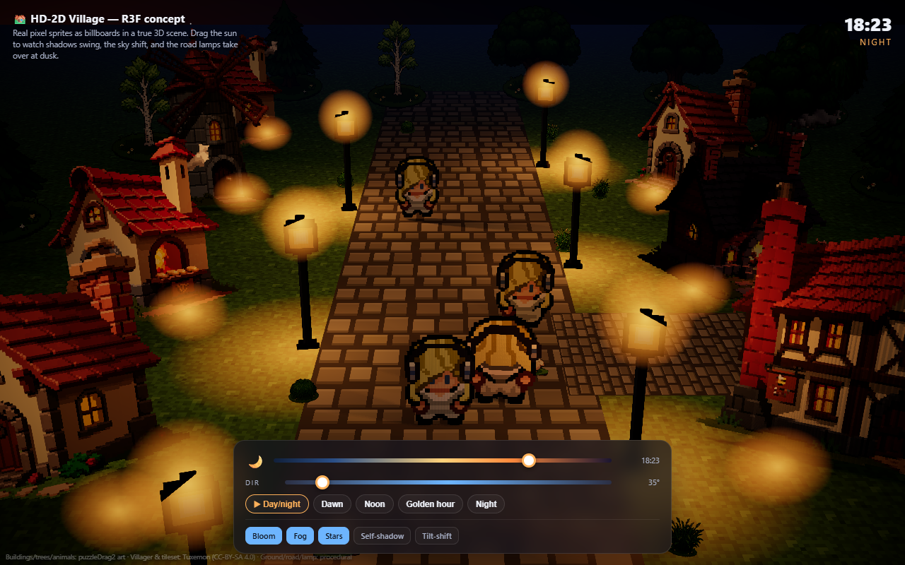
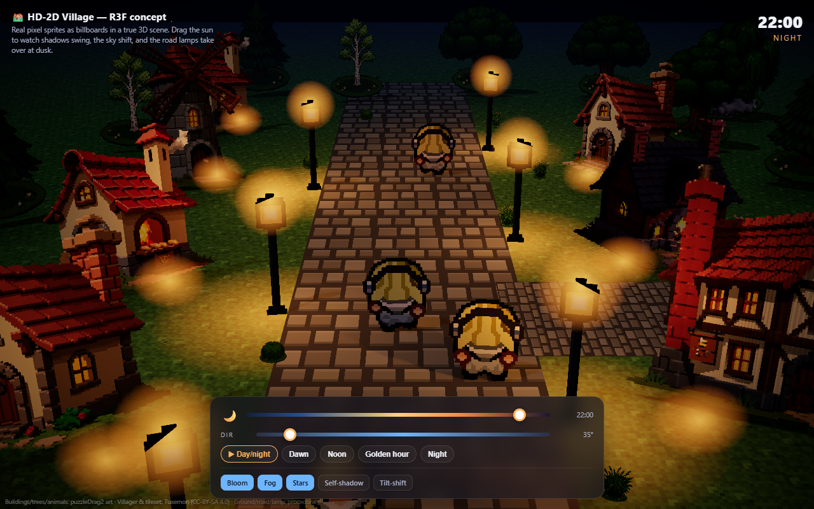
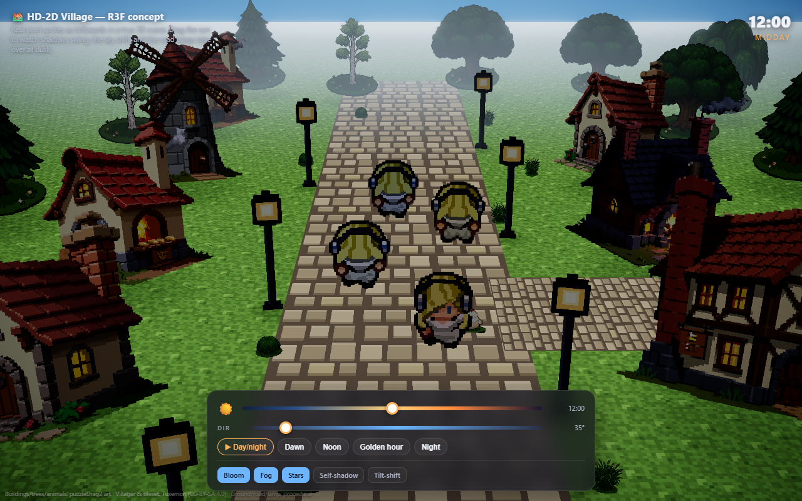
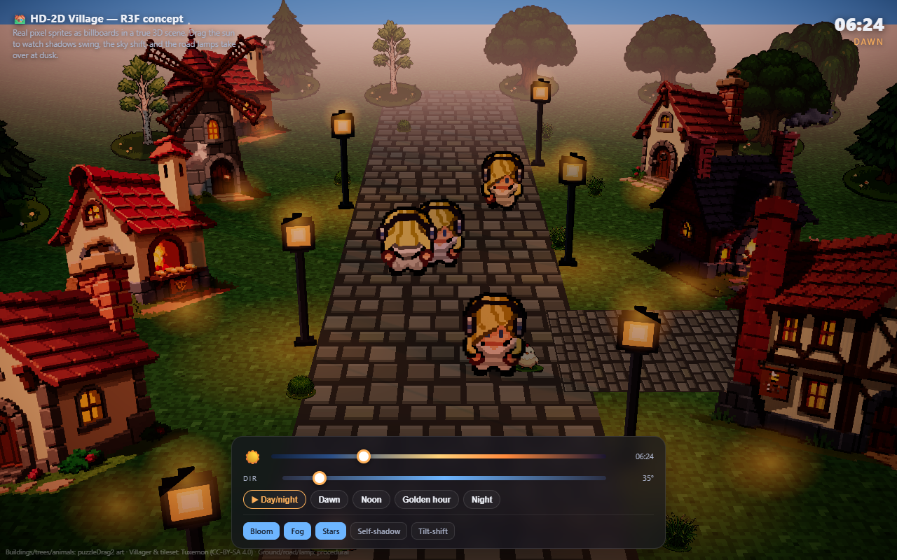
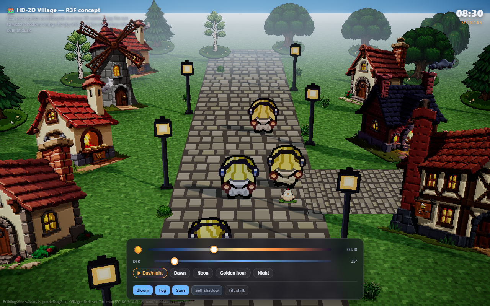
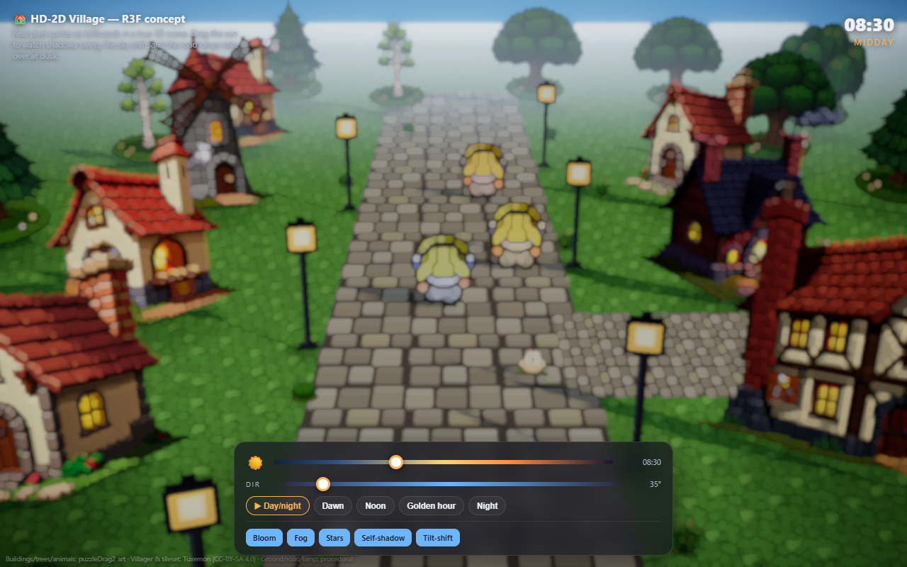
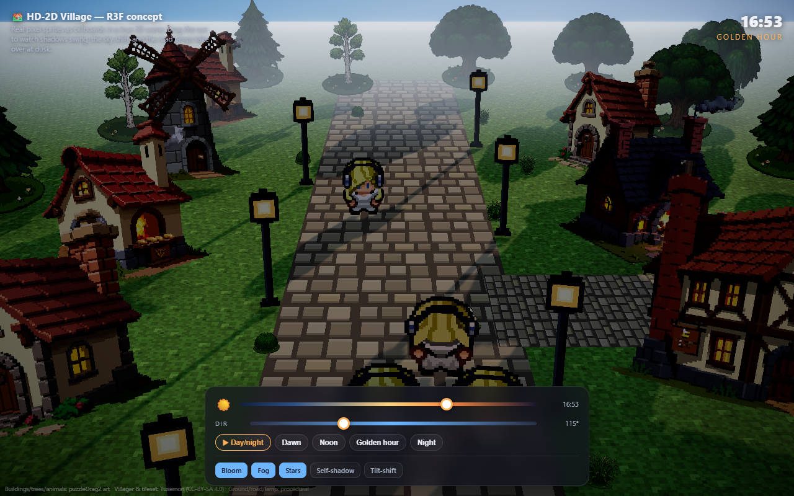

# HD-2D Village — React Three Fiber concept

A self-contained prototype that drops **real puzzleDrag2 pixel sprites into a true 3D scene** and lights
them the [HD-2D](https://en.wikipedia.org/wiki/HD-2D) way (Octopath Traveler / Triangle Strategy): flat
billboard sprites planted on 3D ground, lit and shadowed by real 3D lights, with a **sun you can drag
across the sky** and **warm street lamps that take over at dusk**. Camera is fixed.

It exists to answer one question: *is R3F / HD-2D the visual direction we want?* — so it is deliberately
built end-to-end with real assets rather than placeholders.

| Golden hour | Night | Noon | Dawn |
|---|---|---|---|
|  |  |  |  |

| Normal-map self-shadowing (toggle) | Tilt-shift / depth-of-field (toggle) |
|---|---|
|  |  |

**Sprites cast _and_ receive shadows.** Every sprite sets `receiveShadow`, so a low sun throws
silhouettes that fall *across* the houses, villagers and road — not just onto the ground. Drag the sun low
and rotate the direction to see them stretch and overlap. (A minimal procedural-only reference of just this
mechanic lives in [`../hd2d-village-sim/`](../hd2d-village-sim/).)



## Run it

The demo loads React, three.js, R3F, drei and the postprocessing stack from a CDN (`esm.sh`) via an
import map, and transpiles JSX in the browser with Babel — **no build step**. You only need a static
HTTP server, because browsers treat every `file://` path as a unique origin and **taint WebGL textures
loaded over `file://`** (the sprites would fail to upload, and import maps don't resolve).

From the repo root:

```bash
# any static server works — pick one
npx serve docs                 # then open http://localhost:3000/hd2d-village/
# or
python -m http.server 8000     # then open http://localhost:8000/docs/hd2d-village/
```

> Opening `index.html` directly from disk shows a red "serve over HTTP" notice instead of a blank screen.
> It also needs internet access the first time, to fetch the CDN modules.

## Controls

- **Sun slider** — time of day (00:00–24:00). Drag it and watch shadows swing & lengthen, the sky shift
  dawn→day→dusk→night, the lamps fade in, and a soft moon take over after dark.
- **Dir slider** — sun azimuth; rotates the whole arc so you can throw shadows in any direction.
- **▶ Day/night** — auto-cycle; **Dawn / Noon / Golden hour / Night** jump to a preset.
- **Toggles** — Bloom · Fog · Stars · **Self-shadow** (normal maps) · **Tilt-shift** (depth-of-field).

## What it demonstrates (and how)

| HD-2D technique | Where, in this demo |
|---|---|
| **Billboard sprites in 3D** | Every building / tree / animal / villager is a flat plane (`SpriteCard`) planted at its feet and yaw-rotated to face the fixed camera. |
| **Alpha-cutout shadows** | Each sprite gets a matching `customDepthMaterial` (sun) **and** `customDistanceMaterial` (lamps), both with `alphaTest`, so its shadow is the *silhouette*, not a square. |
| **Sprites react to 3D light** | `MeshStandardMaterial`, so the same sprite tints warm by a lamp, cools at dusk, and dims at night. Facing-independent ambient/hemisphere fill keeps them readable when the overhead sun grazes the flat cards. |
| **Normal-map self-shadowing** | The **Self-shadow** toggle derives an approximate normal map from each sprite's diffuse on a canvas (Sobel of luminance) and feeds it to the material, so the sprite's *interior* re-shades as the light moves — the thing flat billboards can't do on their own. |
| **Movable sun** | One `DirectionalLight` whose position/color/intensity is computed from the time + azimuth sliders; it also drives the gradient sky-dome shader and the fog color. After sunset it lerps into a soft cool **moonlight** so cast shadows stay alive at night. |
| **Multiple lights → outward shadows** | The road lamps are real `PointLight`s; the two by the buildings cast shadows, so at night nearby sprites throw silhouette shadows *radiating away from each lamp*. |
| **Glow / bloom** | Lamp bulbs and the sun are additive sprites that the `Bloom` pass turns into halos; warm light spills onto the cobbles. |
| **Grounding** | A soft contact/AO disc under each sprite (`FootShadow`) keeps them from floating, paired with the long cast shadow. |
| **Atmosphere** | ACES tone mapping (single pass), horizon-tinted fog, a vignette, gentle wind sway on foliage, and an optional tilt-shift (`DepthOfField`) for the diorama look. |

### The two questions from the brief

- **Normal maps for self-shadowing** — wired as the **Self-shadow** toggle. It's an *approximate* normal
  map derived from the diffuse (no authored normal art), so it reads as gentle interior volume rather than
  a hand-tuned map; drag the sun with it on to see the lit side follow the light. For production you'd ship
  real per-sprite normal maps (PixelLab can generate them) for crisper, art-directed self-shadowing.
- **Many lights casting outward shadows** — yes; drag to night and the sprites near the two shadow-casting
  lamps fan their silhouettes outward (point-light shadows are deliberately limited to 2 for performance).

## Assets

- **Buildings, trees, animals** — real puzzleDrag2 art (the 128px building set + seasonal tiles, including
  the animated 9-frame chicken and willow strips).
- **Villagers** — the "Misa" 4-direction walk atlas, **Tuxemon** project, **CC-BY-SA 4.0**.
- **Ground, cobble road, lamp post** — generated procedurally in-canvas (the two assets the library lacked),
  so the road geometry and the lamp's emissive bulb are fully controllable. Easy to swap for real tiles.

## Notes / limitations

- **Mobile** — a `pointer:coarse` / small-width check drops DPR, halves the sun shadow map, and disables
  lamp shadows + tilt-shift, so phones stay interactive.
- The seasonal tile sprites are drawn "object on a pad," so a tree/animal billboard shows its little grass
  pad standing vertically at its base. Reads fine as a ground patch; could be cropped for a cleaner cutout.
- The villager atlas is flatter 16-bit art than the painterly buildings — a small style gap. Bespoke HD-2D
  villagers (and a nicer lamp) could be generated with the project's PixelLab pipeline.
- Verified headless on Windows/SwiftShader; on a real GPU bloom/AA are crisper and there are no
  `glBlitFramebuffer` software-GL warnings.
